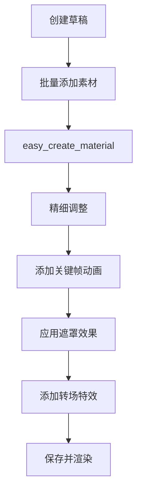

# CapCut Mate API 文档

## 📖 项目简介

CapCut Mate API 是一个基于 FastAPI 构建的剪映小助手，为开发者提供强大的视频编辑自动化能力。通过 RESTful API 接口，您可以轻松创建、编辑和渲染视频内容，无需手动操作剪映软件。

## ✨ 核心功能

### 🎬 视频制作流程

- **草稿管理**：创建、保存、获取草稿信息
- **素材添加**：支持视频、音频、图片、贴纸等多种素材
- **文本处理**：添加字幕、文本样式、关键词高亮
- **特效应用**：视觉特效、动画、转场、遮罩效果
- **视频渲染**：云端生成最终视频文件

### 🔧 技术特性

- **高性能**：基于 FastAPI 构建，支持异步处理
- **类型安全**：使用 Pydantic 进行数据验证
- **标准化**：符合 RESTful API 设计规范
- **自动文档**：集成 Swagger UI 交互式文档
- **容器化**：支持 Docker 部署

## 🚀 快速开始

### 环境要求

- Python 3.11+
- 剪映软件（用于视频渲染）
- uv 包管理器

### 安装部署

```bash
# 1. 克隆项目
git clone https://github.com/Hommy-master/capcut-mate.git
cd capcut-mate

# 2. 安装依赖
uv sync

# 3. 启动服务
uv run main.py

# 4. 或使用 Docker
docker pull gogoshine/capcut-mate:latest
```

### 基础使用

```bash
# 创建草稿
curl -X POST "http://localhost:60000/openapi/capcut-mate/v1/create_draft" \
  -H "Content-Type: application/json" \
  -d '{"width": 1920, "height": 1080}'

# 添加视频素材
curl -X POST "http://localhost:60000/openapi/capcut-mate/v1/add_videos" \
  -H "Content-Type: application/json" \
  -d '{
    "draft_url": "YOUR_DRAFT_URL",
    "video_infos": "[{\"video_url\":\"https://assets.jcaigc.cn/video.mp4\",\"width\":1920,\"height\":1080,\"start\":0,\"end\":5000000,\"duration\":10000000}]"
  }'

# 生成视频
curl -X POST "http://localhost:60000/openapi/capcut-mate/v1/gen_video" \
  -H "Content-Type: application/json" \
  -d '{"draft_url": "YOUR_DRAFT_URL"}'
```

## 📚 API 接口文档

### 🏗️ 草稿管理

| 接口 | 功能 | 描述 |
|------|------|------|
| [create_draft](./create_draft.md) | 创建草稿 | 创建新的剪映草稿项目，设置画布尺寸 |
| [save_draft](./save_draft.md) | 保存草稿 | 保存当前草稿状态，确保编辑内容持久化 |
| [get_draft](./get_draft.md) | 获取草稿 | 获取草稿文件列表和详细信息 |

### 🎥 视频素材

| 接口 | 功能 | 描述 |
|------|------|------|
| [add_videos](./add_videos.md) | 添加视频 | 批量添加视频素材，支持裁剪、缩放、特效 |
| [add_images](./add_images.md) | 添加图片 | 批量添加图片素材，支持动画和转场效果 |
| [add_sticker](./add_sticker.md) | 添加贴纸 | 添加装饰贴纸，支持位置和大小调整 |

### 🎵 音频处理

| 接口 | 功能 | 描述 |
|------|------|------|
| [add_audios](./add_audios.md) | 添加音频 | 批量添加音频素材，支持音量和淡入淡出 |
| [get_audio_duration](./get_audio_duration.md) | 获取音频时长 | 获取音频文件的精确时长信息 |

### 📝 文本字幕

| 接口 | 功能 | 描述 |
|------|------|------|
| [add_captions](./add_captions.md) | 添加字幕 | 批量添加字幕，支持关键词高亮和样式设置 |
| [add_text_style](./add_text_style.md) | 文本样式 | 创建富文本样式，支持关键词颜色和字体 |

### ✨ 特效动画

| 接口 | 功能 | 描述 |
|------|------|------|
| [add_effects](./add_effects.md) | 添加特效 | 添加视觉特效，如滤镜、边框、动态效果 |
| [add_keyframes](./add_keyframes.md) | 关键帧动画 | 创建位置、缩放、旋转等属性动画 |
| [add_masks](./add_masks.md) | 遮罩效果 | 添加各种形状遮罩，控制画面可见区域 |

### 🎨 动画资源

| 接口 | 功能 | 描述 |
|------|------|------|
| [get_text_animations](./get_text_animations.md) | 文本动画 | 获取可用的文本入场、出场、循环动画 |
| [get_image_animations](./get_image_animations.md) | 图片动画 | 获取可用的图片动画效果列表 |

### 🎬 视频生成

| 接口 | 功能 | 描述 |
|------|------|------|
| [gen_video](./gen_video.md) | 生成视频 | 提交视频渲染任务，异步处理 |
| [gen_video_status](./gen_video_status.md) | 查询状态 | 查询视频生成任务的进度和状态 |

### 🚀 快速工具

| 接口 | 功能 | 描述 |
|------|------|------|
| [easy_create_material](./easy_create_material.md) | 快速创建 | 一次性添加多种类型素材，简化创建流程 |

## 🏗️ 系统架构

### 分层设计

```
┌─────────────────┐
│   FastAPI App   │  HTTP API 层
├─────────────────┤
│   Middlewares   │  中间件层（请求预处理、响应格式化）
├─────────────────┤
│   Router (v1)   │  路由层（接口定义、参数验证）
├─────────────────┤
│   Service       │  业务逻辑层（核心功能实现）
├─────────────────┤
│ pyJianYingDraft │  剪映草稿处理层（草稿文件操作）
├─────────────────┤
│     Utils       │  工具层（缓存、日志、任务管理）
└─────────────────┘
```

### 核心模块

- **Router**: API 路由定义和请求处理
- **Service**: 业务逻辑实现和数据处理
- **pyJianYingDraft**: 剪映草稿文件的创建和编辑
- **Schemas**: 数据模型定义和验证
- **Utils**: 缓存管理、日志记录、任务调度

## 🔄 典型工作流程

### 基础视频制作流程


### 进阶制作流程



## 📊 API 使用统计

### 接口分类

- **草稿管理**: 3 个接口
- **素材添加**: 6 个接口  
- **特效动画**: 5 个接口
- **视频生成**: 2 个接口
- **辅助工具**: 2 个接口

### 常用组合

1. **快速制作**: `create_draft` → `easy_create_material` → `gen_video`
2. **精细编辑**: `create_draft` → `add_videos` → `add_audios` → `add_captions` → `add_effects` → `gen_video`
3. **动画制作**: `create_draft` → `add_images` → `add_keyframes` → `add_masks` → `gen_video`

## ⚡ 性能优化

### 建议实践

- **批量操作**: 尽量使用批量接口减少请求次数
- **异步处理**: 视频生成使用异步任务，避免长时间等待
- **缓存机制**: 草稿信息支持缓存，提高访问速度
- **错误重试**: 网络请求失败时自动重试
- **资源预检**: 使用 `get_audio_duration` 等接口预检资源

### 限制说明

- **并发限制**: 避免同时处理过多视频生成任务
- **文件大小**: 建议单个素材文件不超过 100MB
- **时长限制**: 建议单个视频时长不超过 10 分钟
- **请求频率**: 建议控制请求频率，避免服务器过载

## 🔧 更多文档

📖 更多详细文档和教程请访问：[https://docs.jcaigc.cn](https://docs.jcaigc.cn)

## 💬 技术支持

### 获取帮助

- **交互式文档**: 访问 `http://localhost:60000/docs` 查看 Swagger UI
- **问题反馈**: 提交 GitHub Issues
- **商业合作**: 联系邮箱 taohongmin51@gmail.com

### 贡献指南

欢迎提交 Pull Request 来改进项目：

1. Fork 项目
2. 创建功能分支
3. 提交更改
4. 创建 Pull Request

## 📄 许可证

本项目采用 MIT 许可证，详情请查看 LICENSE 文件。

---

**CapCut Mate API** - 让视频创作更简单、更高效！